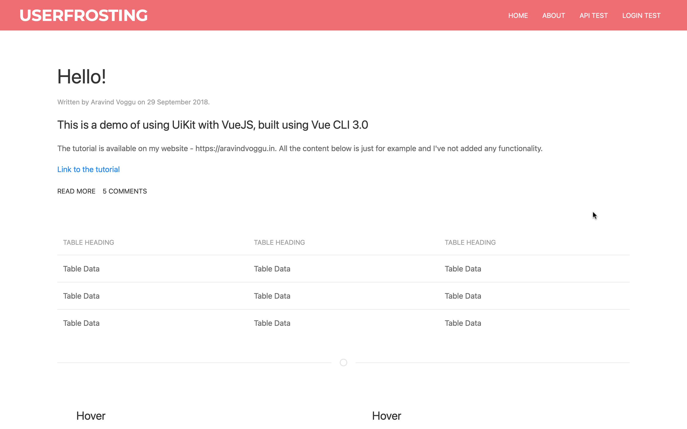
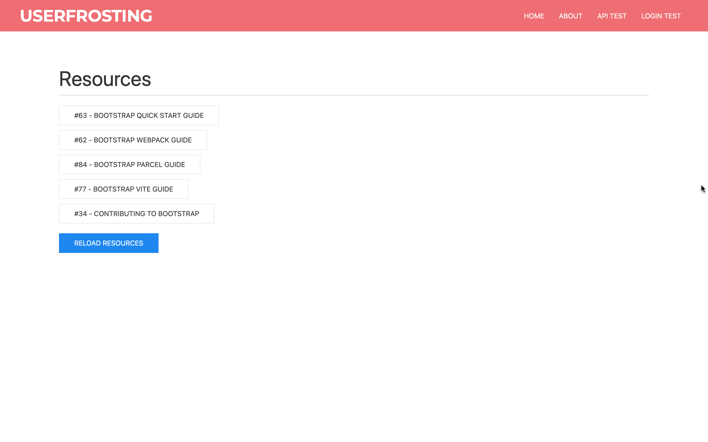
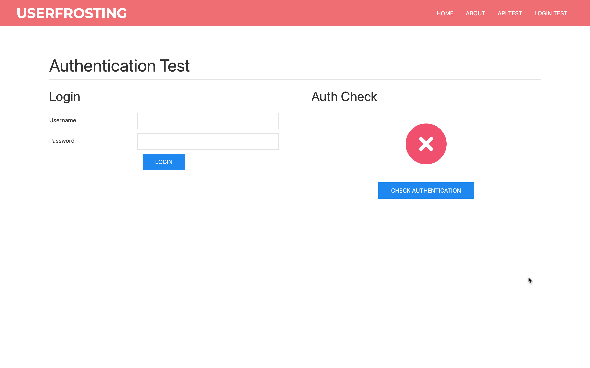

# UserFrosting 5.0 - Vue.js Demo


[](LICENSE.md)
[](https://chat.userfrosting.com/channel/support)
[](https://github.com/userfrosting/demo-vue/actions?query=workflow%3ABuild)
[](https://codecov.io/gh/userfrosting/demo-vue)
[](https://github.styleci.io/repos/689461212)
[](https://github.com/userfrosting/demo-vue/actions/workflows/PHPStan.yml)
[](https://ko-fi.com/lcharette)
<!-- [](https://github.com/userfrosting/UserFrosting/releases) -->
<!-- [](#backers) -->
<!-- [](#sponsors) -->
<!-- [](https://opencollective.com/userfrosting#backer)  -->

[https://www.userfrosting.com](https://www.userfrosting.com)

This is demo of a [Vue.js](https://vuejs.org) single page app working on [UserFrosting 5](https://github.com/userfrosting/UserFrosting/tree/develop-5.0#userfrosting-50) and [UiKit](https://getuikit.com).

## By [Louis Charette](https://bbqsoftwares.com)

Copyright (c) 2023, free to use in personal and commercial software as per the [license](LICENSE.md).

## Documentation

### Installation

1. Clone repo
```
git clone https://github.com/userfrosting/demo-vue.git
```

2. Composer Install
```
composer install
```

3. Bake _(Tip: Use Sqlite file database for rapid local install)_
```
php bakery bake
```

4. Serve locally
```
php -S localhost:8888 -t public 
```

Assets can be build using Bakery or Npm directly:
```
php bakery webpack

// or

npm run dev
```

_More coming soon !_

## Screenshot






<!-- ### [Learning UserFrosting](https://learn.userfrosting.com) -->

<!-- ### [API documentation](http://api.userfrosting.com) -->

## [Change log](CHANGELOG.md)

<!--## Running tests

 Run `php bakery test` from the root project directory. Any tests included in `sprinkles/*/tests` will be run. -->
